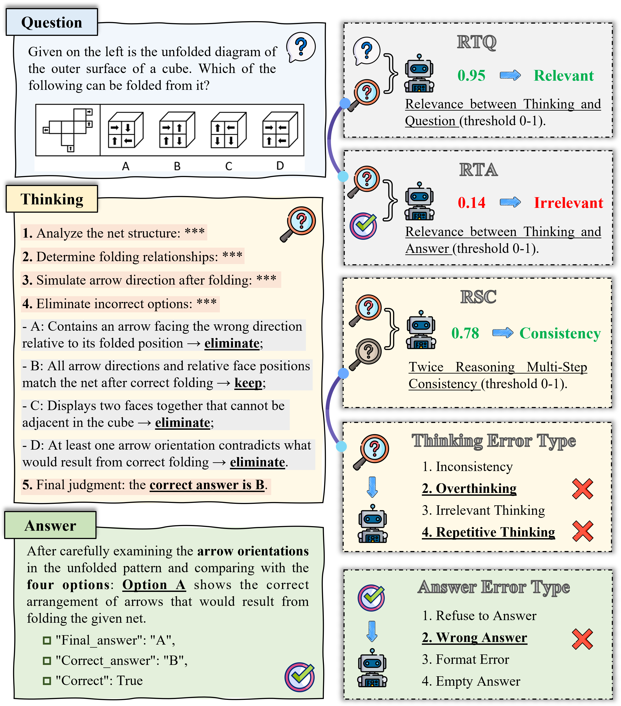
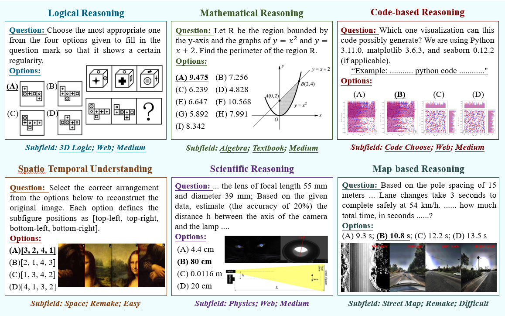
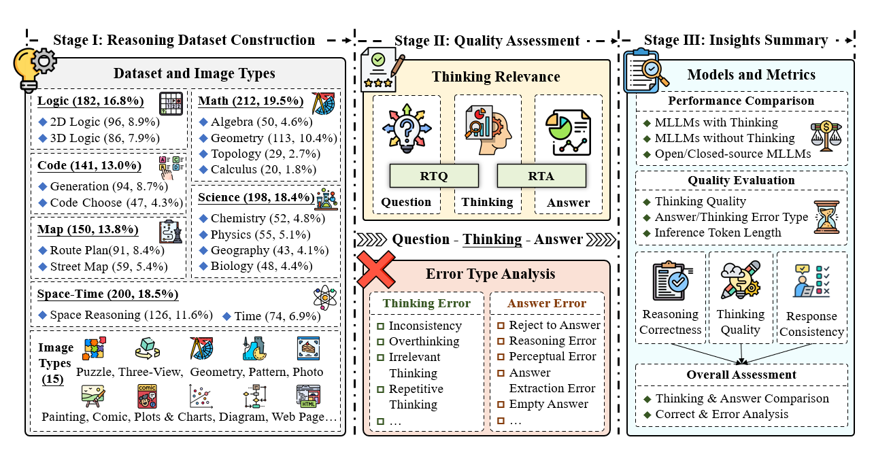

# MMMR-Bench 🔍🧠
**Benchmarking Massive Multi-Modal Reasoning Tasks**

Official repository for **“Benchmarking Massive Multi-Modal Reasoning Tasks”**

---

## 📢 News

- **2025.05.21** 🎉 We are very proud to launch MME-CoT, a new benchmark designed to rigorously evaluate multi-modal reasoning with explicit thinking.

---

## 📘 About MMMR-Bench

Recent advances in Multi-Modal Large Language Models (MLLMs) have enabled unified processing of language, vision, and structured inputs, opening the door
to complex tasks such as logical deduction, spatial reasoning, and scientific analysis. Despite their promise, the reasoning capabilities of MLLMs—particularly
those augmented with intermediate thinking traces (MLLMs-T)—remain poorly understood and lack standardized evaluation benchmarks. Existing work focuses
primarily on perception or final answer correctness, offering limited insight into how models reason or fail across modalities. To address this gap, we introduce the **MMMR**, a new benchmark designed to rigorously evaluate multi-modal reasoning with explicit thinking.

<p align="center">
     <br>
</p>

Leveraging curated high-quality data and a unique evaluation strategy, we conduct an in-depth analysis of state-of-the-art LMMs, uncovering **several key insights**: **(1) Models with reflection mechanism demonstrate a superior CoT quality**, with Kimi k1.5 outperforming GPT-4o and demonstrating the highest quality results; **(2) CoT prompting often degrades LMM performance on perception-heavy tasks**, suggesting a potentially harmful overthinking behavior; **(3) Although the CoT quality is high, LMMs with reflection exhibit significant inefficiency in both normal response and self-correction phases**. We hope MME-CoT serves as a foundation for advancing multimodal reasoning in LMMs.

<p align="center">
     <br>
</p>

The MMMR comprises 1) a high-difficulty dataset of 1,083 questions spanning six diverse reasoning types with symbolic depth and multi-hop demands and 2) a modular Reasoning Trace Evaluation Pipeline (RTEP) for assessing reasoning quality beyond accuracy through metrics like relevance, consistency, and structured error annotation.

<p align="center">
     <br>
</p>

<p align="center">
     <br>
</p>

---

## Evaluation

To calculate the precision, please follow the following steps:
1. Install the required packages.

```bash
pip install -r requirements.txt
```

2. Fill the model config file

create your model config file as the form of sample.json.

3. Run the evaluation scripts

Run the evaluation with the based prompt
'''
cd code
python Based_prompt.py --model_config <your model path> --task_config_file <the dataset json file path> --test_num <test number> --results_file <your results path>
'''

Run the evaluation with the reasoing prompt (with models who have reasoing content)
'''
cd code
python Reasoning_prompt.py --model_config <your model path> --task_config_file <the dataset json file path> --test_num <test number> -results_file <your results path>
'''

Finally, you can fing your results in the results path.

## 🏆 Leaderboard

### Contributing to the Leaderboard

🚨 The [Leaderboard] is continuously being updated, welcoming the contribution of your excellent LMMs!


### Data Usage

We release the MME-CoT data and evaluation prompts for benchmarking on the leaderboard.

You can download the dataset from the [🤗 Huggingface](https://huggingface.co/datasets/csegirl/MMMR) by the following command (make sure that you have installed [related packages](https://huggingface.co/docs/datasets/quickstart)):

```python
from datasets import load_dataset

# Login using e.g. `huggingface-cli login` to access this dataset
ds = load_dataset("csegirl/MMMR")
```